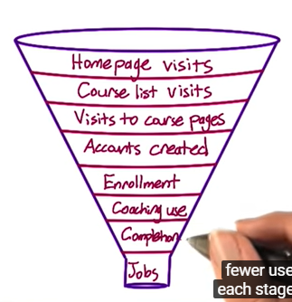
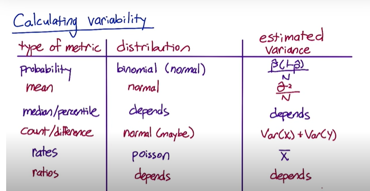

# A/B Testing

## 1. Overview of A/B Testing

Show one set experiment and another original and compare

### Can do

- Observables
- Non-observables

### Cannot do

- New experiences (change aversion, novelty effect)
- Time problem (tend to be short-term)
- Missing something information completely

### Cases:

- Online shopping company: is my site complete?
  - NO. Cannot test on missing information.
- Add premium service
  - NO. Users need to opt-in so random assignment tend not to work. Could be used to gather information.
- Move recommendation site: new ranking algorithms
  - YES.
- Change backend: page load time, results user see
  - YES, if you have computing power for both.
- Car selling website: change increase repeat customers or referrals
  - NO. Low frequency and data collection would be hard。
- Update brand, including main logo
  - NO. Drastic changes can be emotional.
- Test layout of initial page
  - YES.

### Other Techniques

* Retrospective and observational studies
* User survey

## Business Case

- Business: online course platform providing finance courses

- Motivation: test features to increase student engagement

- User flow:

  

- Experiment:

  

  Button to pink to see the increase in number of students moving on from landing page to explore the site

- Metrics:

  - \# of courses completed: take time, final business metric
  - CTR = number of clicks / number of page views -> __usability__
  - Click through probability = unique number of clicks / unique number of users used -> __impact__

### Binomial distribution

Assumptions:

- Binary outcomes
- IID (search engine clicks are not independent, since one no click can be linked to another subsequent click)

$\mathbb{E}[X]=np, \quad Var[X]=np(1-p)$

For click-through-probability, because we are studying $p=\frac{X}{n}$, $\mathbb{p}[X]=p, \quad Var[p]=\frac{p(1-p)}{n}$

### Confidence Interval

95% confidence interval: infinitely repeat, interval covers the population parameter 95% of the time

### Comparing Two Samples

Pooled standard error:

- $\hat{P}_{\text {pool }}=\frac{x_{\text {con }}+x_{\text {exp }}}{N_{\text {con }}+N_{\text {exp }}}$
  $S E_{\text {pool }}=\sqrt{\hat{p}_{\text {pool }} *\left(1-\hat{p}_{\text {pool }}\right) *\left(\frac{1}{N_{con}}+\frac{1}{N_{exp}}\right)}$

### Experiment Design: Sizing

- $\alpha=P(\text{reject null } | \text{ null true})$
- $\beta=P(\text {fail to reject } | \text{ null false})$
- $1-\beta$ sensitivity (power), consider near practical significance level (minimum detectable effect) $d_{min}$, often 80%

Small sample, $\alpha$ low, $\beta$ high

* Size needs to increase when we have a higher click-through-probability (increased SE), confidence level increases, and sensitivity increases
* Size can be decreased when $d_{min}$ increases

## 2. Policy and Ethics for Experiments

### Four Principles of IRB's

* Risk: if beyond minimal risk
* Benefits
* Alternatives: fewer choice, more likely to be coercion
* Privacy: data sensitivity, re-identification risk (watch for time stamps)

### Online Experiment Ethics

- Are participants facing more than minimal risk?
- Do participants understand what data is being gathered?
- Is that data identifiable?
- How is the data handled?

# 3. Metrics

Evaluation steps:

- Business objective

- High level metrics idea

- Detailed metrics definition
- Filtering and Segmenting
- Single metrics or OEC (overall evaluation criterion)
- Applicable metrics

## High-level Ideas

Expanded funnel: 

1. Define business objective
2. Define user funnel
3. Think about counts, rates or probabilities at each and especially the key steps

  

Difficult metrics

- No access to data
- Takes to long

Coming up with metrics or finding proxies:

- External data
- Existing data: retrospective analysis
- Gather new data: user survey, focus group
  - User experience research (UER): good for brainstorming, allow special equipment
  - Focus group
  - Surveys

## Define Metrics

For click-through-probability:

- Def #1: for each time interval, $\frac{\text{# cookies that clicks}}{\text{# cookies}}$
- Def #2: $\frac{\text{# pageviews with click within time interval}}{\text{# pageviews}}$
- Def #3: $\frac{\text{# clicks}}{\text{# pageviews}}$

### Filtering and Segmenting

- Filter: spam or fraud
- Cyclic: day over day or week over week
- Segmentation: by country, by language, by platform

### Summary Metrics

- Sums and counts
- Distributional metrics: mean, median, percentiles, skewness
- Probabilities and rates
- Ratios (any numbers divided by one another)

### Sensitivity and Robustness

- Sensitivity: simple pilot experiments, pick up changes; retrospective and observational
- Robustness: A versus A, won't change without intervention

## Variability

Difference between two rates (Poisson distributions): large sample size and not too small rates, we can assume normal distribution by the law of large numbers.

### Non-parametric methods: Empirical Variability

Analytical -> Bootstrap -> A/A Test

#### A/A Test

(Remember that on average 5% of the experiments would show statistical significance)

Implied standard deviation: check the empirical difference distribution, derive the standard deviation of difference as implied standard deviation

Implied confidence interval: get the interval from empirical differences

#### Bootstrapping

One experiment, take random samples from treatment and control to get different bootstrap groups as many A/A tests 

