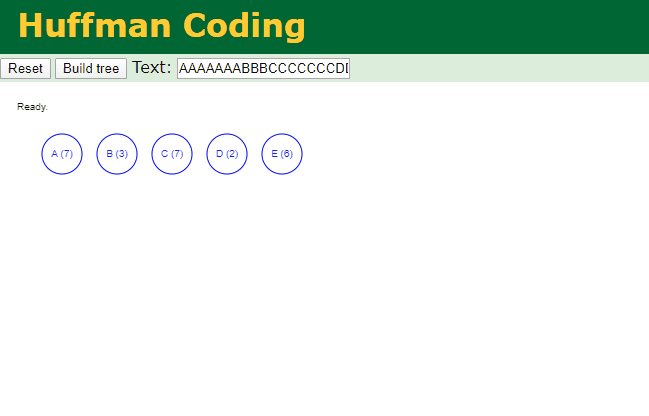

# Overview - Data Compression

In general, a data compression algorithm reduces the amount of memory (bits) required to represent a message (data). The compressed data, in turn, helps to reduce the transmission time from a sender to receiver. The sender encodes the data, and the receiver decodes the encoded data. As part of this problem, you have to implement the logic for both encoding and decoding.

A data compression algorithm could be either **lossy** or **lossless**, meaning that when compressing the data, there is a loss (lossy) or no loss (lossless) of information. The **Huffman Coding** is a *lossless* data compression algorithm. Let us understand the two phases - encoding and decoding with the help of an example.

# Problem Statement

## A. Huffman Encoding

Assume that we have a string message `AAAAAAABBBCCCCCCCDDEEEEEE` comprising of 25 characters to be encoded. The string message can be an unsorted one as well. We will have two phases in encoding - building the Huffman tree (a binary tree), and generating the encoded data. The following steps illustrate the Huffman encoding:

### Phase I - Build the Huffman Tree 

A Huffman tree is built in a bottom-up approach.

1. First, determine the frequency of each character in the message. In our example, the following table presents the frequency of each character.

| (Unique) Character | Frequency |
| :----------------: | :-------: |
|         A          |     7     |
|         B          |     3     |
|         C          |     7     |
|         D          |     2     |
|         E          |     6     |

2. Each row in the table above can be represented as a *node* having a character, frequency, left child, and right child. In the next step, we will repeatedly require to pop-out the node having the lowest frequency. Therefore, build and sort a *list* of nodes in the order lowest to highest frequencies. Remember that a *list* preserves the order of elements in which they are appended.

3. Pop-out two nodes with the minimum frequency from the *priority queue* created in the above step.

4. Create a new node with a frequency equal to the sum of the two nodes picked in the above step. This new node would become an *internal node* in the Huffman tree, and the two nodes would become the children. The lower frequency node becomes a left child, and the higher frequency node becomes the right child. Reinsert the newly created node back into the priority queue.

5. Repeat steps #3 and #4 until there is a single element left in the priority queue. The snapshots below present the building of a Huffman tree.

Below is an animated illustration:

<figure class="image">
	
    <figcaption>Source: https://people.ok.ubc.ca/ylucet/DS/Huffman.html</figcaption>
</figure>

6. For each node, in the Huffman tree, assign a bit `0` for left child and a `1` for right child. See the final Huffman tree for our example:

### Phase II - Generate the Encoded Data

7. Based on the Huffman tree, generate unique binary code for each character of our string message. For this purpose, you'd have to traverse the path from root to the leaf node.

| (Unique) Character | Frequency | Huffman Code |
| :----------------: | :-------: | :----------- |
|         D          |     2     | 000          |
|         B          |     3     | 001          |
|         E          |     6     | 01           |
|         A          |     7     | 10           |
|         C          |     7     | 11           |

The encoded data is `1010101010101000100100111111111111111000000010101010101`

## B. Huffman Decoding

Once we have the encoded data, and the (pointer to the root of) Huffman tree, we can easily decode the encoded data using the following steps:

1. Declare a blank decoded string
2. Pick a bit from the encoded data, traversing from left to right.
3. Start traversing the Huffman tree from the root.
   - If the current bit of encoded data is `0`, move to the left child, else move to the right child of the tree if the current bit is `1`.
   - If a leaf node is encountered, append the (alphabetical) character of the leaf node to the decoded string.
4. Repeat steps #2 and #3 until the encoded data is completely traversed.

# Design

We first need to determine the frequency of each character in the message. Using a dictionary to store the character-to-frequency information, this operation runs in `O(n)`.

We then need to construct a priority queue, where each node stores the character and corresponding frequency, and a node that has lower frequency should have a higher priority to be popped-out. Each time we pop out two nodes, we would create a new node with `None` as key and the sum of the two original nodes' frequency as its frequency. We then set the original node with lower frequency as its left node, and the other as its right node, and push it into the priority queue. When there is only one unique character in the raw text and hence one node in the priority queue, we will create a new node with key `None` and the same frequency, set the original node as its left child, and push it back.

Since the operation described above does not guarantee that it has a lower frequency than all the other nodes in the queue, reinsertion requires sorting. Therefore, we would use a min-heap to hold the nodes. Min-heap works well for our purpose as the smallest elements at the top of the tree are the nodes we want to pop out and merge. Inserting the merged node back into the tree is  also more efficient. On average, building the heap runs in `O(n)` and inserting elements runs in `O(log(n))` taking the number of levels of the binary tree into consideration. The merging process runs in `O(nlog(n))`.

We would then construct the mapping from characters to binary codes. Traversing down the tree, we assign 0 to each left child, and 1 to each right child, append the assigned digit to the code, and pass it down. To encode the message, we simply traverse the raw text from left to right and replace the characters with codes. This runs in `O(n)`. Overall, *time complexity* for encoding is `O(nlog(n))`. *Space complexity* depends on the number of unique characters in the raw text and in worst case scenarios, it is `O(n)`.

To decode the encoded message with the Huffman tree, we would traverse the encoded message, and traverse the Huffman tree until we reach a leaf node. *Time complexity* for decoding is `O(nlog(n))`. *Space complexity* is `O(1)` for decoding as we do not create any data structure to hold information with size dependent on the input.

See below for the file structures.

Programming defensively, we need to watch out for degenerate cases of empty raw text. In this case, the encoding program would abort.

# Files

- [main.py](main.py): contains the `huffman_encoding(text)` and `huffman_decoding(text, tree)` functions. The script takes `--text` argument and illustrates raw text size, encoded text and its size.
- [huffman.py](huffman.py): implements the `HuffmanTree()` class that grows a Huffman tree based on raw text, assign binary codes and construct character-code mapping.
- [node.py](node.py): contains the `HuffmanNode()` class, essentially a binary tree node containing character (key) and frequency (value) information.
- [test.py](test.py): contains test cases for the Huffman encoding and decoding implementation.

